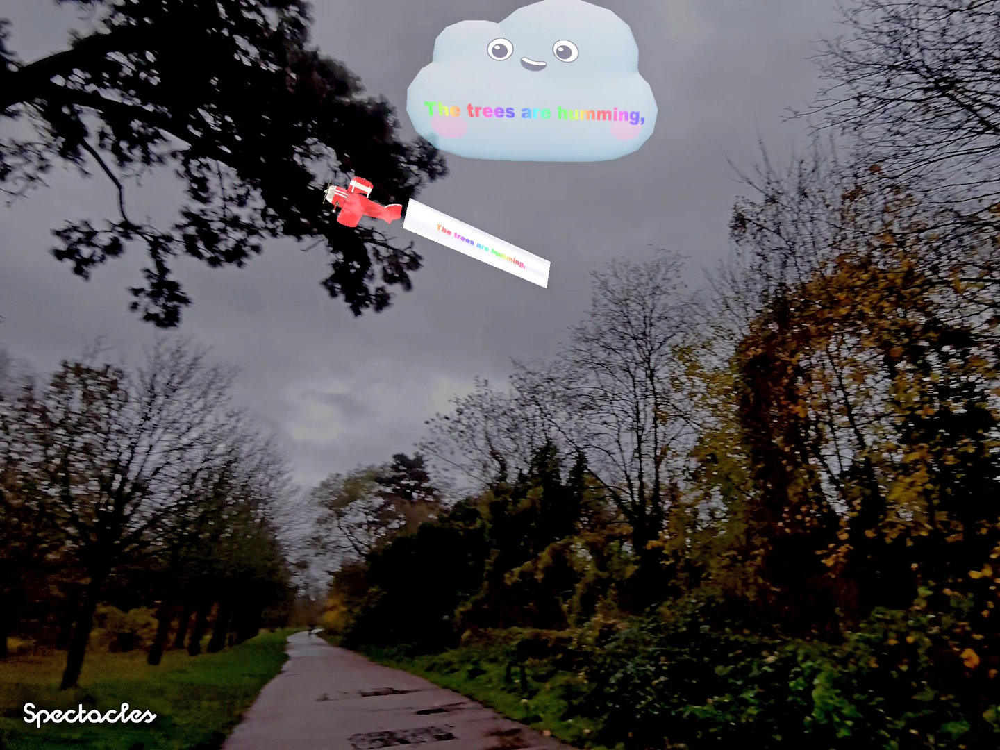

# Lyrics Everywhere : world first AR Lyrics for Snap Spectacles

This project is an Augmented Reality Lens designed for Snap Spectacles, built to display song lyrics directly in the user's field of view — but in a playful and immersive way that goes far beyond a traditional head‑up display.

If you have a pair of Snap Spectacles, you can search for [Lyrics Everywhere](https://www.spectacles.com/lens/2d83bc5eff7342ff8da16c78a8776f21?type=SNAPCODE&metadata=01]

If not, you can watch a video demo : [Lyrcis Everywhere Lens for Snap Spectacles on Youtube](https://youtu.be/mG_LEPo_CX4)

Want to talk, comment and give feedback ? Here is the sub-reddit: [Lyrics Everywhere for Snap Spectacles on Reddit](https://www.reddit.com/r/Spectacles/comments/1pafjom/lyrics_everywhere_bringing_song_lyrics_into_the/)

# 🎯 Goal

Instead of overlaying plain text on the screen, the Lens anchors lyrics to the real world through creative 3D interactions and charming animated characters. The user discovers lyrics as part of their environment, enriching both immersion and storytelling.

The result is an augmented performance where lyrics feel part of the physical world: diegetic, playful, contextual, and alive. Perfect for creative music experiences and immersive storytelling on Snap Spectacles.

# ✨ Features

## ⏭️ Play, Pause, Stop, Change song (in development)
Look at your right hand and control the song you are listening to.

## 🐰 Fluffy Rabbit with a Sign

A soft, adorable rabbit appears in the scene holding a sign that displays the current lyric line. As the song evolves, the rabbit updates the sign with new lines.

## ✈️ Airplane Pulling a Banner

A small vintage airplane flies across the user's field of view, towing a long banner where the lyrics scroll or appear dynamically.

## 🧑‍🤝‍🧑 Other people

When meeting other people, speech or dreaming bubbles appear above their head synchronized with the music.

## ☁️ Singing Cute Cloud

A smiling fluffy cloud sings along and shows lyrics.

## 🕺 Lyrics & Dance Steps on the Ground

The ground becomes a stage: lyrics, arrows, and dance‑step markers appear at the user's feet, guiding them through movements or simply enhancing the rhythm visually.

## 🤚 Quick lyrics hand shortcut

Just look at your left hand and read the lyrics appearing along your fingers

# 🧩 How It Works

The Lens uses world tracking, face tracking, hand-tracking to anchor elements into the physical environment. Each lyric event is tied to a specific animation or object, creating a spatial and narrative flow:

- Lyrics sync with the timeline of the music
- 3D characters react or animate accordingly
- Objects may appear, move, or disappear as the lyrics progress

# 🛠️ Technology

- Snap Lens Studio for lens creation, TypeScript for scripting
- Asset Library, SketcfFab, Blender, Powerpoint for UI/3D assets
- World Mesh, Facetracking to anchor content into real‑world space
- Custom Lyrics encoding, decoding, synchro inspired by Distrokid JSON format

# 📄 License

Feel free to adapt, remix, or build upon this project. Attribution is appreciated.

Thanks to [ScanTasticWorld](https://sketchfab.com/ScanTasticWolrd) for the [Rabbit](https://sketchfab.com/3d-models/rabbit-c5fdc23b56334f21a7f6edea4ebbfe69)
Thanks to [3dWalkabout](https://sketchfab.com/3dwalkabout) for the [Tree](https://sketchfab.com/3d-models/tree-trunk-26-c17ad39c0c964e3f8da7cd14408166e5)
Thanks to [Suno](https://suno.com) for generating the [Sunshine Dance Song](https://suno.com/song/0488bbc8-5101-40a5-8045-d30d551bd9ed?sh=hFuEM9M5ndEvChg5)
